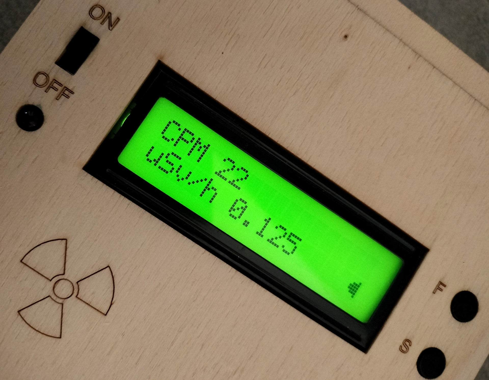
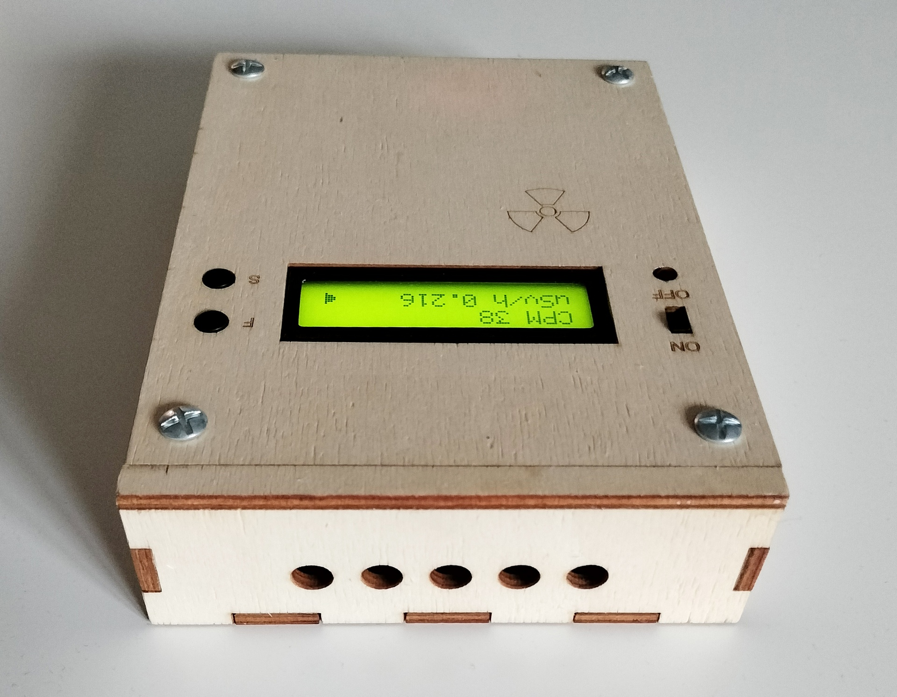
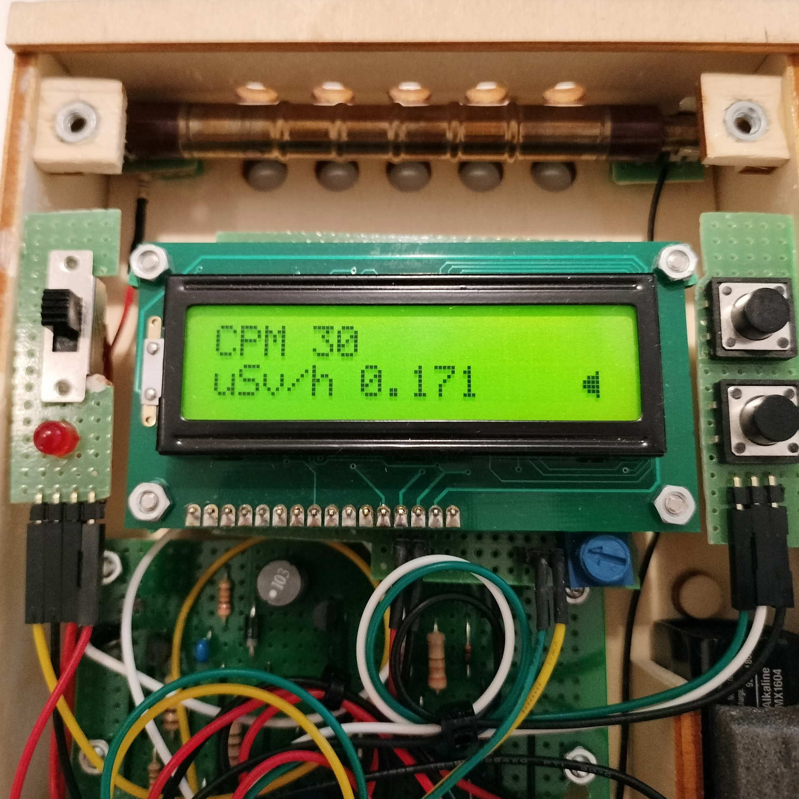
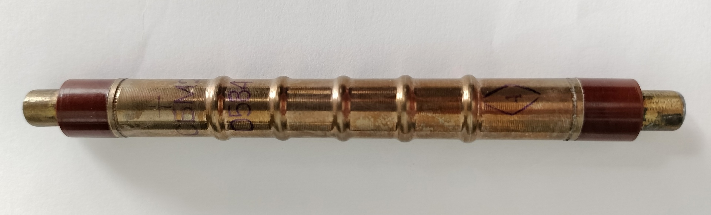
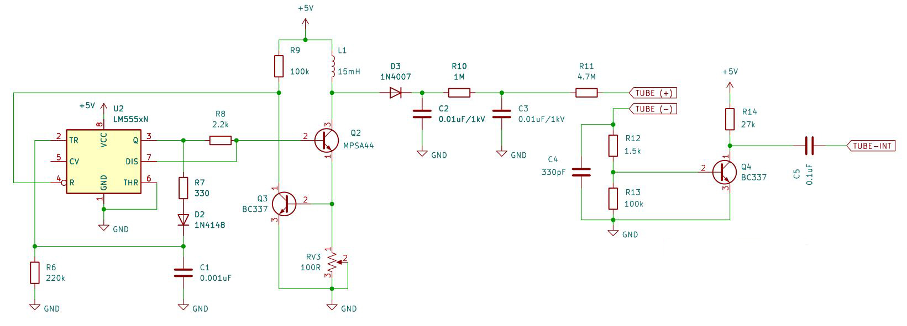
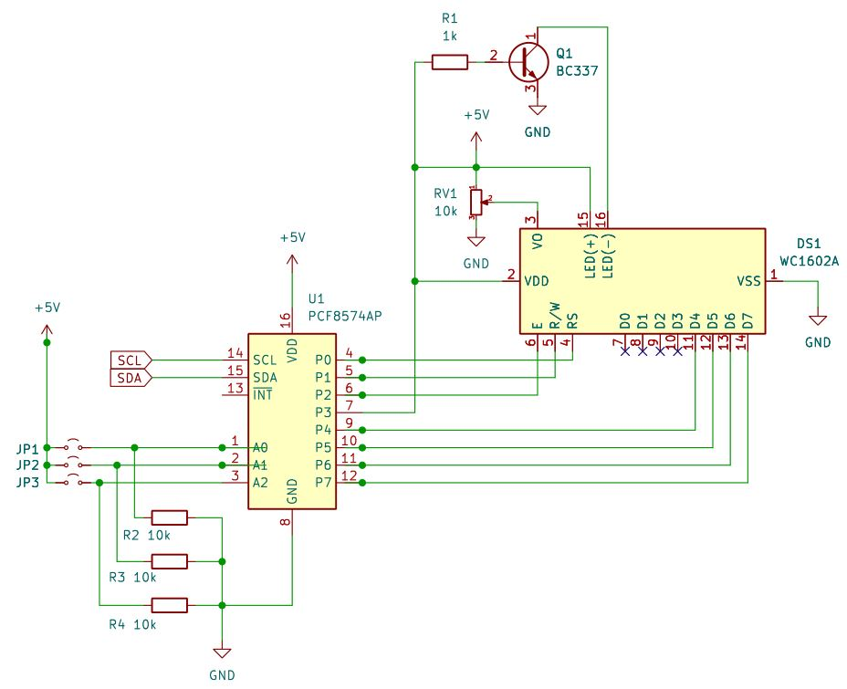
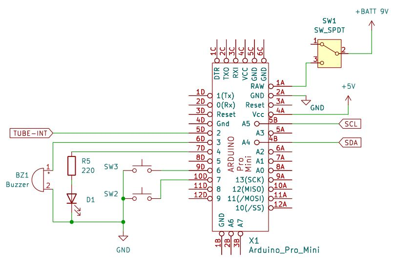

# Arduino_Geiger
A Geiger-Muller radiation detector prototype with Arduino Pro Mini and a SBM-20 tube.

  

## How a Geiger counter works
A Geiger counter (or Geiger-Muller counter) is a simple radiation detector consisting in a sealed tube filled with an inert gas, typically argon or xenon, at low pressure. The tube contains two electrodes kept at high differential voltage. When energetic radiations enter the counter, it ionizes the gas, creating pairs of free electrons and positive ions from atoms. The high electric field between the two electrodes causes the electrons to travel toward the positive electrode, called anode. The accelerated electrons can gain enough kinetic energy to ionize more atoms in an "avalanche" process. This charge amplification generates a sufficient number of electrons at the anode that a large electric pulse is available at the tube output, even with a low primary charge due to the ionizing radiation.

The type of radiation that can be detected depends on the tube material and construction. For alpha particles, that cannot penetrate the metallic walls of the tube, there is a windows at one end, covered with a thin layer of mica, al low density material. For gamma, x-ray and beta radiation a windowless tube is generally used.

Each tube shall be calibrated in order to convert the number of pulses detected in a time period (usually CPM: count per minutes) in a dose rate: micro-sievert per hour.

### SBM-20 tube
The SBM-20 is a low-cost popular G-M tube that can be easily found on ebay. It is most sensitive to high energy beta and gamma radiation. It works with a nominal voltage of 400V.

## Circuit diagram
The circuit is made of three components: the LCD display driver, the Arduino pro mini and the high voltage generator.

### High voltage generator 
This module generates a voltage of 400V for the Geiger tube from the stabilized 5V output of the Arduino Mini board. The design is taken from [diygeigercounter](https://sites.google.com/site/diygeigercounter/home), with a minor modification: the buzzer driver circuit has been removed and replaced by a digital output pin of the Arduino, moreover the transistor MPSA44 has been used in place of STX13005. The fundamental spec of this component is the ability to sustain a high voltage between collector and emitter. The site sold a complete geiger counter kit but now it seems to be discontinued. Anyway a very detailed circuit description is still available [here](https://sites.google.com/site/diygeigercounter/technical/circuit-description).

Basically a 555 timer is used to generate a pulse train that switches the transistor Q2 which allows current to flow through the inductor L1. After a cetrain time, depending on the variable resistor RV3, the transistor Q3 is turned on and the pulse is reset, resulting in a sudden opening of Q2. This causes a high voltage between the inductor and the transistor. The high voltage value is controlled by the on-time of Q2 and therefore by regulating the variable resistor RV3. 
The high voltage spike passed the diode D3 and charges the storage capacitors C2 and C3 that level the supply voltage for the tube. This voltage remains constant because the current generated by a count in the Geiger tube is very low. Each particle detected generates a voltage spike at the tube catode, that turn on Q4 through a voltage divider. This creates the 5V pulse that can be sent to the interrupt pin of Arduino.

### LCD driver
This circuit interfaces Arduino with a 16x2 LCD display (ACM1602B Series). It uses a PCF8574 I/O expander for converting the I2C bus commands to 8-bit parallel signals. The jumpers JP1, JP2 and JP3 are used to set the bus address.

### Arduino 
An Arduino Pro Mini is the processing unit that receives the pulses from the tube on a digital input pin programmed to trigger an interrupt at each event. It computes the dose rate from the moving average of the pulse count at regular time intervals. It reads two push buttons SW2 and SW3, controls the LCD display through the I2C bus and notifies the tube counts with a LED indicator and a piezoelectric buzzer.

A button is used to switch between the available functions, the second button to toggle the corresponding option:
- continous dose monitoring (moving average of the counts in 3 seconds intervals)
- average dose in an arbitrary time interval
- dose computed in fixed time intervals (1 or 2 minutes)
- sound on/off
- LCD background light on/off

## Software
In Arduino IDE select the board "Arduino Pro or Pro Mini" and install the library `LiquidCrystal_I2C`. 

# Acknowledgements
Thanks to ["DIY Geiger"](https://sites.google.com/site/diygeigercounter/home) for the electronic circuit description.

# License
This program is licensed under MIT.